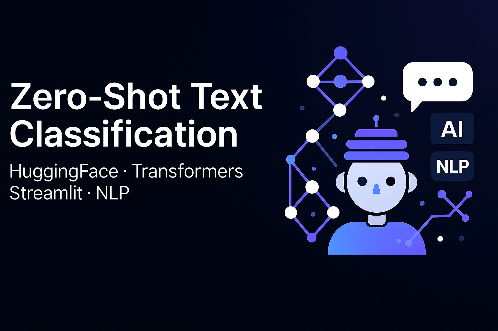

<p align="center">
  
</p>

# 📘 Zero-Shot Text Classification using Pretrained Transformers

This project demonstrates **Zero-Shot Learning (ZSL)** using pretrained Transformer models. 

With Zero-Shot Learning, a model can classify text into new or unseen categories without any task-specific training—simply by providing labels in natural language. This app utilizes Hugging Face’s `zero-shot-classification` pipeline and provides a lightweight Streamlit UI for easy interaction.

---

## 🚀 Features

* **Classify any input text** into custom labels dynamically.
* **No training or dataset required.**
* **Three switchable pretrained models:**
    * `facebook/bart-large-mnli`
    * `roberta-large-mnli`
    * `valhalla/distilbart-mnli-12-1` (Fastest)
* **Clean Streamlit Interface** for user-friendly interaction.
* **Visualizations:** Confidence table + bar charts.
* **Export Results:** Download classifications as CSV.
* **Offline Mode:** Works entirely offline after models are downloaded once.

---

## 🧠 What is Zero-Shot Learning?

Zero-Shot Learning allows a model to generalize to new tasks or labels it was never trained on. The model uses semantic understanding learned from MNLI (Natural Language Inference) to infer the best match.

**Example:**
> **Text:** “NASA launched a new satellite.”
> **Labels:** “technology, politics, food”
> **Output:** technology

---

## 📂 Project Structure

```text
zero_shot_from_scratch/
│── app.py              # CLI version (terminal-based classifier)
│── streamlit_app.py    # Web interface using Streamlit
│── save_result.py      # Save single run to JSON/CSV
│── batch_classify.py   # Batch classification from examples.txt
│── verify_setup.py     # Checks model + torch installation
│── requirements.txt    # Dependencies
│── assets/
│   └── examples.txt    # Sample sentences
└── README.md           # Documentation
```
---

## 🛠️ Setup

### 1️⃣ Create Virtual Environment

```bash
# Create the environment
python -m venv venv

# Windows
.\venv\Scripts\activate

# macOS/Linux
source venv/bin/activate
```
### 2️⃣ Install Dependencies
```Bash

pip install --upgrade pip
pip install -r requirements.txt
```
### 3️⃣ Verify Installation
This will automatically download the model on the first run (~1.6GB).

```Bash

python verify_setup.py
```

---

## 🖥️ Usage
▶ Run Streamlit Web App (Recommended)
Open the browser link (usually http://localhost:8501) to use the interactive UI.

```Bash

streamlit run streamlit_app.py
```

▶ Run CLI Classifier
Run the classifier directly in your terminal.

```Bash

python app.py --text "Apple released a new iPhone." --labels "technology,sports,politics,food"
```

---

## 📊 Output Example
Input: Apple released a new iPhone with longer battery life.
Labels: technology, sports, politics, food
Output:

```JSON

{
  "Predicted label": "technology",
  "Confidence": {
    "technology": 0.9827,
    "sports": 0.0098,
    "politics": 0.0039,
    "food": 0.0037
  }
}
```

---

## 🧪 Batch Classification
To run classification on a list of examples:

```Bash

python batch_classify.py
```
Outputs results to batch_results.csv.

---

## 📈 Why This Project Is Useful
* Great demonstration of Zero-Shot Learning.
* Shows flexibility of ML models using inference-only pipelines.
* Useful for:
     * Topic classification
     * Intent detection
     * Auto-tagging
     * Quick prototyping when labeled datasets aren’t available

---

## 📚 Technologies Used
- Python 3.10+
- Hugging Face Transformers
- PyTorch
- Streamlit
- Pandas

---

## 📝 Future Enhancements
- Add more HF models (DeBERTa, XLM-RoBERTa, etc.)
- Build a multi-label classifier version
- Add comparison view: multiple models side-by-side
- Add text upload (.txt file) for batch classification via UI

---

## 👨‍💻 Author
- Rishi Bakliwal
- LinkedIn:[rishibakliwal](https://www.linkedin.com/in/rishi-bakliwal-1a5851244/)
- GitHub:[TechTitanR](https://github.com/TechTitanR)
